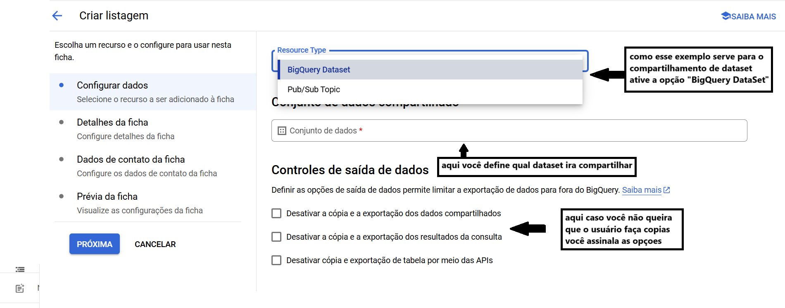

## Analytics Hub
O Analytics Hub é uma ferramenta do Google Cloud Platform (GCP) acessada por meio do BigQuery. Ele permite o compartilhamento e edição de datasets, além da edição de assinaturas, com outras pessoas de forma totalmente segura. O proprietário (owner) concede permissões através de assinaturas, permitindo que outros usuários acessem o dataset ou realizem queries de maneira controlada.

## Assinatura
O proprietário de um dataset pode publicar dados em um data exchange no Analytics Hub. Esse data exchange é como um catálogo de dados, onde ele define quais datasets serão disponibilizados e quais permissões estarão associadas a eles.
Usuários interessados podem se inscrever como assinantes do data exchange. A assinatura permite que os assinantes acessem o dataset publicado conforme as permissões configuradas pelo proprietário, como visualização ou execução de queries.

## Atualização Automática
Quando o proprietário do dataset faz uma modificação, essa alteração é automaticamente refletida para o usuário em tempo real, sem a necessidade de downloads manuais ou sincronizações periódicas.

## Permissão para Visualização
O usuário não pode visualizar todo o dataset, mas apenas as colunas que o proprietário permitir. Dessa forma, é possível restringir a visualização de determinadas colunas, especialmente quando elas contêm dados sensíveis, garantindo maior segurança ao proprietário.

## Permissão para Realizar Query
O usuário pode realizar determinadas queries, mas o proprietário pode restringir o acesso a certas consultas. Isso permite limitar que o usuário execute apenas queries específicas e acesse os insights autorizados.

## Controle e Revogação de Acesso
Como proprietário, você pode, a qualquer momento, remover permissões de acesso para um usuário, restringindo completamente o acesso ao dataset, se necessário.

## Custos para o Usuário
Cada usuário é responsável pelos custos dos serviços utilizados no dataset. Cada job tem seu valor, e o usuário pode consultar o Billing para monitorar as despesas geradas pela plataforma. A política de cobrança do BigQuery permite que os proprietários compartilhem dados sem arcar com os custos das operações realizadas pelos assinantes.

## Custos para o Proprietário
O proprietário não paga para configurar, conceder ou revogar assinaturas e permissões dentro do Analytics Hub. Os custos só são aplicáveis ao proprietário se ele próprio executar jobs, como queries, transformações ou exportações em seus próprios dados no BigQuery. A gestão de acessos e assinaturas no Analytics Hub, portanto, não gera cobranças adicionais para o owner.

## Analytics hub na pratica

- Abrindo o bigquery 
 

- Encontrando um DataSet
 

- Link do DataSet 
 

- Caminho para encontrar o analytics hub
 

- Criação de troca de DataSet
 
- Tela de criação 
 

- Tornando publico o DataSet
 

- Permissoes de troca 
 

- Criando listagem 
 

 

- Configurando o DataSet
 

- Nome que sera exibido e qual o tipo do DataSet
 

- Mark down(opcional)
 

- Contatos 
 

- Definindo que pode assinar o DataSet
 
 

- Quem podera assinar 
 

- Todos os leitores podem ver que existe o DataSet
 

### Obs: Neste exemplo, escolhi um usuário que já possuía os papéis necessários para conceder uma assinatura. Caso queira inserir um usuário externo, é necessário definir alguns papéis para ele através do IAM.
- Escolhendo quem pode assinar o DataSet

- Selecionando papel para assinatura

- Tela do usuario

## Encontrando a troca que foi criada

 ## Tela do assinante

 
  

  