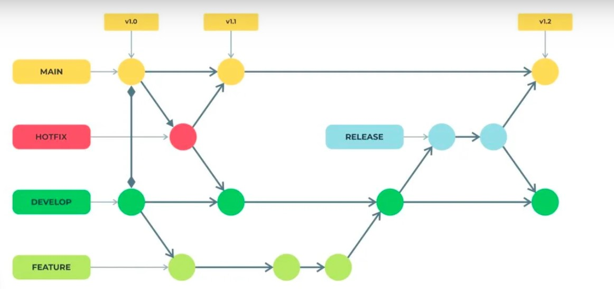

## RELATÓRIO DE ESTUDOS
## Nome do estagiário: David Francisco Vieira
## Data: 20/08/2024

## TEMA: ENGENHARIA DE DADOS
essa area é responsável por coletar,garantir a segurança e armazenar dados de maneira eficiente. um engenheiro de dados também cuida da infraestrutura, garantia de um bom sinal de rede, software adequado e hardware funcional. Além disso, o engenheiro trabalha na manutenção do sistema e no armazenamento de grandes volumes de dados(big data) em data lake e data warehouse, que são serviços pagos pelas empresas conforme a necessidade. O data lake armazena qualquer tipo de dado, seja ele estruturado ou não e tem um custo menor comparado ao data warehouse. Em contraste, o data warehouse aceita apenas dados estruturados, que passam por um processo de ETL que seria um filtro que cuida dos dados antes de serem armazenados, o que o torna mais caro.

 

## GIT 
Git seria uma ferramenta muito importante para o desenvolvimento de um projeto em equipe, já que ele permite modificar versões daquilo que foi desenvolvido, pois nele você pode criar branches e versioná-las.

## GITFLOW
O que seria Gitflow? É a maneira como você gerencia as branches para ordenar as etapas do projeto e também seria uma boa prática pelo fato de deixar um projeto mais profissional. mudanças dentro de features (versões do programa) criadas de acordo com o que você está trabalhando, um método muito importante e essencial para o desenvolvimento de um projeto. Através dele, podemos informar o que estamos fazendo através do histórico dentro do Git, onde podemos alterar e informar suasando. Por exemplo, uma equipe que está desenvolvendo um jogo: cada um deve criar uma feature (branch) com o nome do que está trabalhando e, assim que ele criar essa feature, deve informar a equipe através do campo chamado "projects" e selecionar como "in progress". Depois de finalizada, deve subir para a "development". Logo após a etapa de subir para a development, você deve excluir a branch que foi criada. E, após garantir que foi feito o pull request e a confirmação do merge para a develop, você deve subir para a release, garantindo que está tudo certo para subir para a main ou a master, que seria a branch principal."

## BIG DATA
É uma area de conhecimento que está cada vez mais se atualizando de acordo com o crescimento e as necessidades das grandes empresas, que precisam armazenar um grande número de dados e informá-los em tempo real, além de gerar insights que servem para descobrir dados importantes e analisar possíveis anomalias. Isso é possível porque é uma ferramenta que recebe grandes volumes de dados em alta velocidade. A palavra "insights" se refere a percepções ou entendimentos valiosos.
Uma grande vantagem do big data é a capacidade de receber vários tipos de dados, sejam eles estruturados, semi-estruturados e não estruturados. Por exemplo, uma empresa de streaming precisa receber dados em tempo real, conhecidos como "dados quentes". Esses dados necessitam de uma ferramenta rápida. Porém, essa é uma das dificuldades encontradas no big data, devido ao fato de armazenar grandes volumes de dados em tempo real.

Alguns exemplos de desafios ao utilizar o big data incluem:
- **Armazenamento:** Gerenciar e armazenar grandes volumes de dados de maneira eficiente.
- **Processamento:** Processar rapidamente grandes quantidades de dados para extrair insights em tempo real.
- **Privacidade e Segurança:** Proteger dados sensíveis e garantir a conformidade com regulamentações de privacidade.
- **Qualidade dos Dados:** Garantir que os dados sejam precisos, completos e livres de erros, além de identificar anomalias, dado o grande volume de dados recebidos.
É importante destacar que plataformas de Big Data, como: **Apache Spark, bancos de dados NoSQL (por exemplo, MongoDB, Cassandra),** e ferramentas de visualização de dados têm ganhado popularidade.

## MODELAGEM DE DADOS 
A modelagem de dados é o processo de obter vários tipos de dados, sendo eles: semi-estruturados, estruturados e não estruturados, e modelá-los por etapas para se trabalhar de forma correta, já que o processo de modelagem de dados é composto pelas etapas de modelo conceitual, lógico e físico. Depois de obter as informações, você pode desenvolver modelos: lógico, físico ou conceitual, dependendo das necessidades da empresa que for armazená-los.

**MODELO CONCEITUAL -** Essa é a etapa onde os dados são organizados em tabelas para se relacionarem, indicando sua cardinalidade, como por exemplo: 1:1, N:N, N:1 ou 1:N.
A cardinalidade depende de como essas tabelas se relacionam. Por exemplo, o ID serve para indicar um único valor, e, em outra tabela, uma PK (Primary Key) é convertida em uma chave estrangeira (Foreign Key - FK).

**MODELO LÓGICO -** Esta etapa é praticamente uma conversão do modelo conceitual para o lógico. Depois da etapa do modelo conceitual, você poderá indicar o que seria chave secundária e sua cardinalidade.

**MODELO FÍSICO -** Nessa etapa, você já pode classificar os itens da tabela, definindo se são variáveis do tipo: INT, DOUBLE, VARCHAR, TEXT, entre outros. Também pode fazer a manutenção usando comandos como os exemplos abaixo:

**ALTER TABLE** Clientes

**RENAME COLUMN** Telefone **TO** Telefone_Principal

**ALTER TABLE** Clientes

**DROP COLUMN** Telefone

**DOUBLE** preço (10,2)   

**INT** quantidade de livros(60)

Nesse caso, estamos nos referindo a pequenos dados. Já quando se trata de uma empresa que necessita de mais espaço para armazenar um número muito grande de dados (Big Data), a empresa deve contratar um Data Lake ou até mesmo um Data Warehouse.

## ANALÍTICO

O termo analítico se refere ao processo de extrair dados importantes de um data lake ou data warehouse, gerar insights e auxiliar em grandes decisões de uma empresa. Esse processo tem como objetivo apoiar engenheiros de dados, analistas, cientistas de dados e empresários. Esse processo envolve o uso de algumas ferramentas, como: **olap, Apache Spark, Google Big Query, Amazon Redshift e Microsoft Azure Synapse Analytics.**

Abaixo irei explicar sobre as ferramentas citadas. 

## OLAP
Esta é uma ferramenta utilizada para analisar dados obtidos de um data warehouse. Ela serve para obter os mínimos detalhes sobre os dados armazenados dentro de um data warehouse.

**Beneficios :** 
- Consultas rápidas e complexas em grandes volumes de dados, facilita a análise detalhada e exploração de diferentes aspectos dos dados, ajudando a descobrir padrões e tendências que não seriam evidentes em tabelas planas.

**Desafios encontrados:**
- Necessidade de grande espaço de armazenamento e poder de processamento devido ao armazenamento de dados redundantes. A manutenções e atualizações periódicas. Além disso, OLAP pode não ser adequado para dados transacionais ou em tempo real, pois pode não refletir alterações recentes. 

## APACHE SPARK
O Apache Spark é um framework open source para processamento rápido de dados em tempo real, projetado para trabalhar em clusters, o que permite a execução de várias tarefas simultaneamente, ideal para big data. Ele suporta diversas APIs em várias linguagens e lida com dados estruturados, semi-estruturados, não estruturados, além de processar grafos. O Spark pode ser integrado ao Apache Hadoop, mas não depende dele para funcionar.

**Beneficios:**
- Desempenho em executar tarefas, seja em um único nó ou em um cluster de milhares. O Spark processa dados desde gigabytes até petabytes, oferecendo escalabilidade. Ele realiza múltiplas tarefas, como processamento de dados, consultas SQL, análise em tempo real e machine learning.

**Desafios encontrados:**

- Alto consumo de memória, isso faz com que o desempenho seja lento. 
Ainda há uma curva de aprendizado significativa para novos usuários no processamento de Big Data. Além disso, não é ideal para dados em pequena escala, pois esta voltado para ambientes de cluster.

## GOOGLE BIG QUERY
O BigQuery é uma ferramenta de big data do Google Cloud que suporta SQL e pode ser usada como um data warehouse para armazenar diversos tipos de dados, como informações de redes sociais. Ele gera análises em tempo real, fornecendo insights valiosos para decisões empresariais, como a previsão de produtos mais pesquisados. Além disso, o BigQuery pode ser usado no setor de segurança, analisando o histórico e comportamento de usuários para prever possíveis ataques cibernéticos.

**Beneficios:**
- O BigQuery lida big data pois usa a  infraestrutura da Google Cloud, tem ótimo desempenho em consultas analíticas, essencial para decisões em tempo real, facilitando a análise de dados de diversas fontes. redução na necessidade de manutenção, permitindo que as equipes se concentrem na análise. 
preços flexíveis, como modelagem de custos por consulta ou armazenamento de dados, permitindo que as empresas otimizem seus gastos de acordo com suas necessidades específicas.

**Desafios encontrados:**

- Apesar do big query ser escalavel ainda sim pode gerar um custo alto pelo fato de trabalhar com big data e realizar consultas mais complexas, exigindo otimização e gestão cuidadosa. A migração de dados para o BigQuery pode ser complexa pois depende muito da infraestrutura da Google Cloud, o que pode limitar opções para algumas empresas. Além disso, a modelagem de dados pode ser desafiadora para usuários inexperientes e o BigQuery pode não suportar todas as funcionalidades avançadas, exigindo integração com outras ferramentas.

## AMAZON REDSHIFT
Essa ferramenta da Amazon é voltada para análises com suporte a data warehouse, eliminando a necessidade de criar clusters. Ela é escalável, usando colunas em vez de tabelas e processamento paralelo para maximizar o desempenho. Possui baixo custo, oferece backup contínuo que se atualiza conforme os dados são modificados, e é compatível com PostgreSQL, permitindo o uso de dados armazenados nesse sistema.

**Beneficios:**
- Essa ferramenta é uma boa opção de banco de dados em nuvem escalável, rápida e segura para empresas que precisam armazenar e analisar grandes quantidades de dados. Ele oferece uma série de recursos de gerenciamento de dados e segurança, bem como uma integração fácil com outras ferramentas e sistemas, o que a torna uma opção atraente para muitas empresas.

**Desafios encontrados:**

- Algumas das vezes essa ferramenta corre um risco na falha na conexão e consultas travadas, que podem impactar a eficiência e a confiabilidade. Além disso, o desempenho das consultas pode ser lento e o processo de carregamento de dados pode falhar ou demorar excessivamente. Problemas adicionais incluem dados incorretos durante o carregamento, o que pode comprometer a integridade e a precisão das informações. Esses desafios podem afetar a performance geral e a usabilidade do Redshift.

## AZURE SYNAPSE ANALYTICS
O Azure Synapse é uma ferramenta que acelera a extração de insights em tempo real a partir de big data, data warehouse e data lakes. Ele permite buscas ilimitadas e rápidas usando SQL e outras linguagens, integrando a análise de dados relacionais e não relacionais. A plataforma unifica cargas de trabalho de data warehousing com big data e oferece recursos avançados de segurança, como criptografia, controle de acesso baseado em função, segurança em nível de coluna e linha, além de integração com serviços de segurança do Azure.

**Beneficios:**

- Ela é uma ferramenta que oferece uma ampla gama de conformidade, atendendo às necessidades regulatórias de diversos setores. Com preços flexíveis, permite pagar apenas pelo uso, adaptando-se a empresas de todos os tamanhos. Com segurança multicamadas, protege dados críticos, sendo confiável para empresas, governos e startups.

**Desafios encontrados:**
- Podem ter um custo elevado e exigir tempo para ser dominado, o que pode complicar o uso para iniciantes. seu desenpenho pode afetar tarefas que precisam de resposta rápida, e a forte integração com Azure pode limitar opções de migração. A conexão com ferramentas externas pode ser desafiadora, e a gestão dos recursos pode ser difícil, especialmente para equipes menos experientes.

