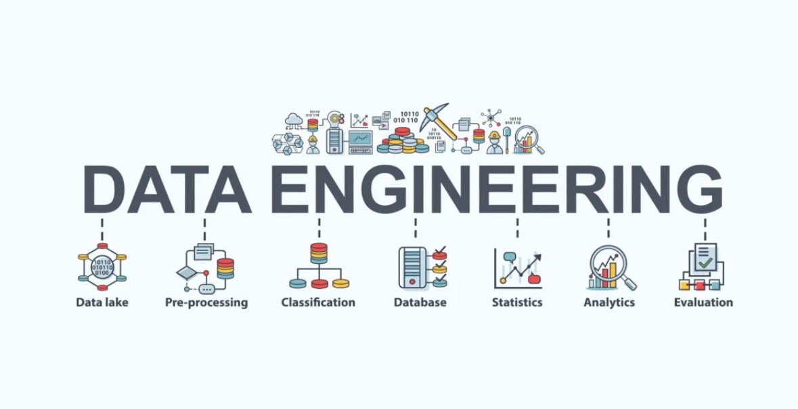

## RELATÓRIO DE ESTUDOS
## Nome do estagiário: David Francisco Vieira
## Data: 19/08/2024

**Módulos**  
1. [**Engenharia de dados**](#engenharia)
2. [**Git**](#git)
3. [**Big Data**](#BIGDATA)
4. [**Modelagem de dados**](#modelagem)
5. [**Banco de dados**](#database)
6. [**Analitico**](#analítico)


## ENGENHARIA DE DADOS
Essa área é responsável por coletar, garantir a segurança e armazenar dados de maneira eficiente. Um engenheiro de dados também cuida da infraestrutura, garantindo um bom sinal de rede, software adequado e hardware funcional. Além disso, o engenheiro trabalha na manutenção do sistema e no armazenamento de grandes volumes de dados em data lakes ou data warehouses, que são serviços pagos pelas empresas conforme a necessidade. O data lake armazena qualquer tipo de dado, seja ele estruturado ou não, a um custo menor. Em contraste, o data warehouse aceita apenas dados estruturados, que passam por um processo de ETL, que seria um filtro que cuida dos dados antes de serem armazenados, o que o torna mais caro.

 

## GIT 
Git é uma ferramenta muito importante para o desenvolvimento de um projeto em equipe, pois permite modificar versões do que foi desenvolvido. Nele, você pode criar branches (linhas de desenvolvimento independentes) e versioná-las, tornando o desenvolvimento mais fácil. Isso possibilita que um número ilimitado de pessoas trabalhe no projeto, cada uma responsável por uma etapa específica, utilizando uma feature branch (branch dedicada a uma nova funcionalidade ou melhoria no projeto).


## Principais comandos
                            
```GIT INIT``` 
cria um novo repositório do Git. Ele pode ser usado para converter um projeto existente e não versionado em um repositório do Git ou inicializar um novo repositório vazio.

```GIT ADD .``` //Prepara todos os arquivos e mudanças no diretório atual para o próximo commit.

```GIT COMMIT -M``` "informação do que foi feito" //
comando para indicar o que foi feito no programa para poder subir para o github


```GIT BRANCH -M MAIN``` // 
renomeia a branch que voce esta e passa para a main.

```GIT REMOTE ADD ORIGIN https://github.com/Davidfranciscoads/Exemplo.git ``` //
comando para Conectar o repositório local a um repositório remoto no GitHub.

```GIT PUSH -U ORIGIN MAIN``` 
// esse comando envia um commit para a branch main do repositorio local no github.

```GIT PULL ORIGIN DEVELOP``` 
// comando para baixar a versão que esta na develop 

```GIT CLONE``` <URL-do-repositório>
// comando para clonar para a maquina local o projeto que esta no github.

```GIT STATUS``` 
// mostra o status atual do repositorio.


## GITFLOW
O que seria Gitflow? É a maneira como você gerencia as branches para ordenar as etapas do projeto e também seria uma boa prática pelo fato de deixar um projeto mais profissional. mudanças dentro de features (versões do programa) criadas de acordo com o que você está trabalhando, um método muito importante e essencial para o desenvolvimento de um projeto. Através dele, podemos informar o que estamos fazendo através do histórico dentro do Git, onde podemos alterar e informar suasando. Por exemplo, uma equipe que está desenvolvendo um jogo: cada um deve criar uma feature (branch) com o nome do que está trabalhando e, assim que ele criar essa feature, deve informar a equipe através do campo chamado "projects" e selecionar como "in progress". Depois de finalizada, deve subir para a "development". Logo após a etapa de subir para a development, você deve excluir a branch que foi criada. E, após garantir que foi feito o pull request e a confirmação do merge para a develop, você deve subir para a release, garantindo que está tudo certo para subir para a main ou a master, que seria a branch principal."

**GIT FLOW NA PRATICA** 

 


## BIG DATA
É uma área de conhecimento que está cada vez mais se atualizando de acordo com o crescimento e as necessidades das grandes empresas, que precisam armazenar um grande número de dados e processá-los em tempo real, além de gerar insights que servem para descobrir informações importantes e analisar possíveis anomalias. Isso é possível porque é uma ferramenta que recebe grandes volumes de dados em alta velocidade. A palavra 'insights' se refere a percepções ou entendimentos valiosos.
Uma grande vantagem do Big Data é a capacidade de receber vários tipos de dados, sejam eles estruturados, semi-estruturados ou não estruturados. Por exemplo, uma empresa de streaming precisa receber dados em tempo real, conhecidos como 'dados quentes'. Esses dados necessitam de uma ferramenta rápida. Porém, essa é uma das dificuldades encontradas no Big Data, devido ao fato de armazenar grandes volumes de dados em tempo real.
Alguns exemplos de desafios ao utilizar o Big Data incluem:
Armazenamento: Gerenciar e armazenar grandes volumes de dados de maneira eficiente.
Processamento: Processar rapidamente grandes quantidades de dados para extrair insights em tempo real.
Privacidade e Segurança: Proteger dados sensíveis e garantir a conformidade com regulamentações de privacidade.
Qualidade dos Dados: Garantir que os dados sejam precisos, completos e livres de erros, além de identificar anomalias, dado o grande volume de dados recebidos.
É importante destacar que plataformas de Big Data, como Apache Spark, bancos de dados NoSQL (por exemplo, MongoDB, Cassandra), e ferramentas de visualização de dados têm ganhado popularidade.

## MODELAGEM DE DADOS 

A modelagem de dados é o processo de obter vários tipos de dados, sendo eles: semi-estruturados, estruturados e não estruturados, e modelá-los por etapas para se trabalhar de forma correta, já que o processo de modelagem de dados é composto pelas etapas de modelo conceitual, lógico e físico. Depois de obter as informações, você pode desenvolver modelos: lógico, físico ou conceitual, dependendo das necessidades da empresa que for armazená-los.

**MODELO CONCEITUAL** - Essa é a etapa onde os dados são organizados em tabelas para se relacionarem, indicando sua cardinalidade, como por exemplo: 1:1, N:N, N:1 ou 1:N.
. A cardinalidade depende de como essas tabelas se relacionam. Por exemplo, o ID serve para indicar um único valor, e, em outra tabela, uma PK (Primary Key) é convertida em uma chave estrangeira (Foreign Key - FK).

**MODELO LÓGICO** - Esta etapa é praticamente uma conversão do modelo conceitual para o lógico. Depois da etapa do modelo conceitual, você poderá indicar o que seria chave secundária e sua cardinalidade.

**MODELO FÍSICO** - Nessa etapa, você já pode classificar os itens da tabela, definindo se são variáveis do tipo: INT, DOUBLE, VARCHAR, TEXT, entre outros. Também pode fazer a manutenção usando comandos como os exemplos abaixo:

**ALTER TABLE** Clientes

**RENAME COLUMN** Telefone **TO** Telefone_Principal

**ALTER TABLE** Clientes

**DROP COLUMN** Telefone

**DOUBLE** preço (10,2)   

**INT** quantidade de livros(60)

Nesse caso, estamos nos referindo a pequenos dados. Já quando se trata de uma empresa que necessita de mais espaço para armazenar um número muito grande de dados (Big Data), a empresa deve contratar um Data Lake ou até mesmo um Data Warehouse.

## ANALÍTICO

O termo analítico se refere ao processo de extrair dados importantes de um data lake ou data warehouse, gerar insights e auxiliar em grandes decisões de uma empresa. Esse processo tem como objetivo apoiar engenheiros de dados, analistas, cientistas de dados e empresários.
Esse processo envolve o uso de algumas ferramentas, como: **olap, Apache Spark, Google BigQuery, Amazon Redshift e Microsoft Azure Synapse Analytics.**

### Abaixo irei explicar sobre as ferramentas citadas.

### OLAP
- Esta é uma ferramenta utilizada para analisar dados obtidos de um data warehouse. Ela serve para obter os mínimos detalhes sobre os dados armazenados dentro de um data warehouse.

### APACHE SPARK 

- Ele é um framework open source que serve para fazer pesquisas de forma mais rápida, já que possui um grande poder de processamento e pode processar dados em tempo real. Isso se deve ao fato de ter sido desenvolvido com o objetivo de trabalhar em cluster (conjunto de máquinas), permitindo a execução de várias tarefas ao mesmo tempo e lidando com big data. O Apache Spark também oferece suporte a diversas APIs em várias linguagens e a diferentes tipos de dados, como estruturados, semi-estruturados e não estruturados, além de processar grafos. Ele também é uma ferramenta que trabalha em conjunto com o Apache Hadoop.

### GOOGLE BIG QUERY 

- O BigQuery é uma ferramenta de big data do Google Cloud que oferece suporte à linguagem SQL. Ele pode ser usado como um data warehouse, armazenando diversos tipos de dados, como informações de redes sociais. Com capacidade de gerar análises em tempo real, o BigQuery fornece insights valiosos para a tomada de decisões empresariais, sugerindo e prevendo, por exemplo, os produtos mais pesquisados por usuários. Além disso, ele pode ser utilizado no setor de segurança ja que ele é uma ferramenta para analise de dados a nivel de usuario, analisando e modelando seu histórico e comportamento para prever possíveis ataques cibernéticos.

### AMAZON REDSHIFT

- Essa é uma ferramenta da Amazon voltada para análises, com suporte para data warehouse. Ela é um produto pronto, o que elimina a necessidade de criar máquinas. Trabalha de forma escalável, utilizando colunas em vez de tabelas e processamento paralelo para aproveitar todo o poder da máquina. Além disso, possui baixo custo e oferece backup contínuo, atualizando os backups conforme os dados são modificados. Também é compatível com PostgreSQL, permitindo que você utilize um drive com informações armazenadas no PostgreSQL.

### AZURE SYNAPSE ANALYTICS

- A proposta dessa ferramenta é acelerar a extração de insights importantes em tempo real a partir de big data, data warehousing e data lakes. Ela permite realizar buscas ilimitadas para análises de dados, fornecendo rapidamente insights a partir de todos os seus dados, utilizando o melhor da tecnologia SQL e outras linguagens de consulta.
Azure Synapse permite a análise de dados relacionais e não relacionais de maneira integrada, unificando cargas de trabalho tradicionais de data warehousing com análise de big data.
Além disso, o Azure Synapse oferece otimos recursos de segurança e privacidade dos dados, como criptografia, controle de acesso baseado em função, segurança em nível de coluna e linha, e integração com serviços de segurança do Azure para proteger dados sensíveis.


OLAP - essa é uma ferramenta que serve para analisar dados obtidos de um data warehouse, ele serve para obter os minimos detalhes sobre dados de dentro de um data warehouse.
 

